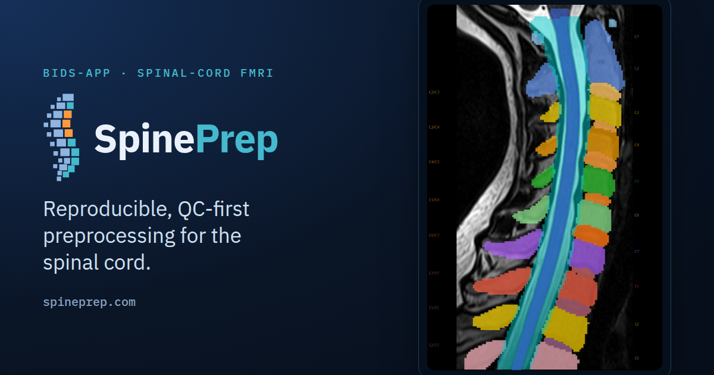
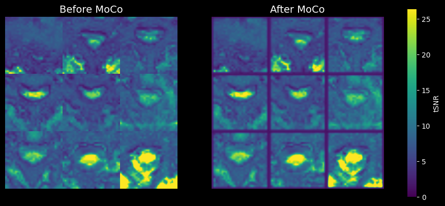

<p align="center">
  <a href="https://spineprep.com"></a>
</p>

<p align="center">
  <a href="https://github.com/SpinePrep/SpinePrep/actions/workflows/ci.yml"></a>
  <a href="https://github.com/SpinePrep/SpinePrep/releases"></a>
  <a href="LICENSE"></a>
  <a href="https://www.python.org/"></a>
  <a href="https://spineprep.com/"></a>
  <a href="https://neurostars.org/tag/spineprep"></a>
  <!-- Zenodo DOI badge added after the first archived release. -->
</p>

<p align="center">
  <strong>Reproducible, QC-first preprocessing for human spinal-cord fMRI.</strong><br>
  An open, containerised BIDS-App — a BIDS dataset in, GLM-ready derivatives and per-step quality control out.
</p>

---

SpinePrep automates the field's recommended cord-fMRI recipe end to end, with **one
step-local truth metric and one visual reportlet at every step**. It follows the
design of the established brain pipelines (fMRIPrep, MRIQC, SCT) and applies it to
a 5–7 mm structure that moves, distorts, and spans vertebral levels.

The scientific methods belong to the tools SpinePrep integrates — the
[Spinal Cord Toolbox](https://spinalcordtoolbox.com/), FSL, ANTs, and the PAM50
template. **SpinePrep's contribution is the integration, automation,
reproducibility, and standardised quality control around them**, not new algorithms.

> [!NOTE]
> SpinePrep is at **v1.0.0** and methods validation is **ongoing**. It has been
> developed and tested on cervical spinal-cord EPI-BOLD at 3 T across eight public
> and internal datasets; it runs outside that envelope but warns you. See the
> [validation page](https://spineprep.com/validation/) for current evidence and
> known limits.

## Pipeline

```mermaid
flowchart LR
  IN([BIDS]) --> S1[S1 Input verify] --> S2[S2 Anat cordref] --> S3[S3 Func ref + crop]
  S3 --> S4[S4 Motion] --> S5[S5 Distortion] --> S6[S6 Func to anat]
  S6 --> S7[S7 PAM50 normalize] --> S8[S8 Confounds] --> S9[S9 Derivatives] --> S10[S10 QC release]
  S10 --> OUT([GLM-ready derivatives + QC report])
```



Each step measures itself in isolation (its own pass/warn/fail metric) and emits a
diagnostic reportlet, so a failure is attributable to the step that caused it.

## Quality control is the validator

Every run produces self-contained HTML reports — the human eyeballs the figures;
the numbers quantify the call. One reportlet should tell you *what failed and why*.

<p align="center">
  
</p>

## Installation

### Container (recommended)

SpinePrep ships as a **build recipe**, not a prebuilt image — a deliberate choice.
The container installs FSL, which is free for academic/non-commercial use but
carries non-commercial licence terms. Building the image yourself (rather than us
redistributing one that bundles FSL) keeps SpinePrep's own Apache-2.0 distribution
unencumbered, and you obtain FSL directly under its own licence.

```bash
git clone https://github.com/SpinePrep/SpinePrep.git
cd SpinePrep
docker build -f Dockerfile.spineprep \
  --build-arg GIT_SHA=$(git rev-parse HEAD) \
  --build-arg GIT_DESCRIBE=$(git describe --always --tags) \
  -t spineprep:1.0.0 .
```

For HPC, convert the image to Apptainer — see the
[quickstart](https://spineprep.com/quickstart/).

### Local (advanced)

The Python orchestration layer installs with `pip`, but the full pipeline also
needs **SCT, FSL, and ANTs** on your `PATH` (the container provides these). A PyPI
release is planned; for now, install from a clone:

```bash
git clone https://github.com/SpinePrep/SpinePrep.git
cd SpinePrep && pip install .
```

## Quickstart

SpinePrep uses the standard BIDS-App interface:

```bash
# participant level: preprocess each subject
docker run --rm -v /path/to/bids:/bids:ro -v /path/to/out:/out \
  spineprep:1.0.0 /bids /out participant --participant-label sub-01

# group level: aggregate QC and write the release report
docker run --rm -v /path/to/bids:/bids:ro -v /path/to/out:/out \
  spineprep:1.0.0 /bids /out group
```

See the [documentation](https://spineprep.com/) for options, configuration, and the
full walkthrough.

## What you get

- **BIDS-native** — a BIDS dataset in, BIDS-Derivatives out; no manual masking.
- **Cord-focused** — segmentation, motion, distortion and PAM50 normalization tuned
  for the cord, not adapted from brain defaults.
- **Readable QC** — one truth metric and one reportlet per step, plus subject- and
  group-level HTML reports with a reconciled attrition waterfall.
- **Reproducible** — deterministic runs, versioned policy, and a provenance receipt
  (tool + policy + git SHAs); a re-run reproduces the same numbers under the same
  tool versions.

## Documentation

Full documentation lives at **[spineprep.com](https://spineprep.com/)**:

- [Quickstart](https://spineprep.com/quickstart/) · [Install & use](https://spineprep.com/tutorial/)
- [Methods (S1–S10)](https://spineprep.com/methods/overview/) · [Validation](https://spineprep.com/validation/)
- [CLI](https://spineprep.com/reference/cli/) · [Configuration](https://spineprep.com/reference/config/) · [Cite](https://spineprep.com/cite/)

## Citation

If you use SpinePrep, please cite the software and the tools it builds on
(SCT, FSL, ANTs, PAM50) — the auto-generated methods boilerplate in each report
lists them, and [How to cite](https://spineprep.com/cite/) gives the references.

```bibtex
@software{spineprep,
  title   = {SpinePrep: a containerised BIDS-App for reproducible
             spinal-cord fMRI preprocessing},
  author  = {Sharifi, Kiomars},
  year    = {2026},
  version = {1.0.0},
  url     = {https://spineprep.com}
}
```

GitHub's "Cite this repository" button reads
[`CITATION.cff`](CITATION.cff) and always gives the current form.

## Contributing

Contributions are welcome — see [CONTRIBUTING.md](CONTRIBUTING.md) and the
[Code of Conduct](CODE_OF_CONDUCT.md). For **usage questions**, please post on the
[NeuroStars `spineprep` tag](https://neurostars.org/tag/spineprep) rather than the
issue tracker, so answers stay searchable for the next person.

## Acknowledgements

SpinePrep builds directly on the [Spinal Cord Toolbox](https://spinalcordtoolbox.com/),
FSL, ANTs, and the PAM50 template, and follows the design philosophy of
[fMRIPrep](https://fmriprep.org/). We are grateful to those projects and their
communities.

## License

Apache-2.0 — see [LICENSE](LICENSE). SpinePrep integrates third-party tools under
their own licences; see [NOTICE](NOTICE).
