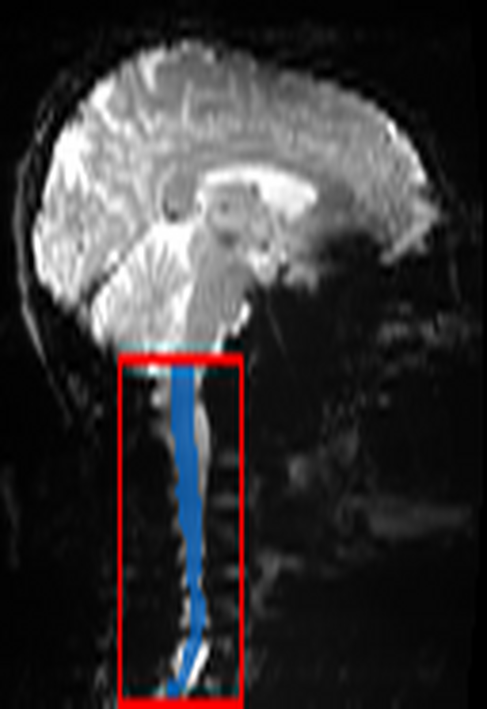
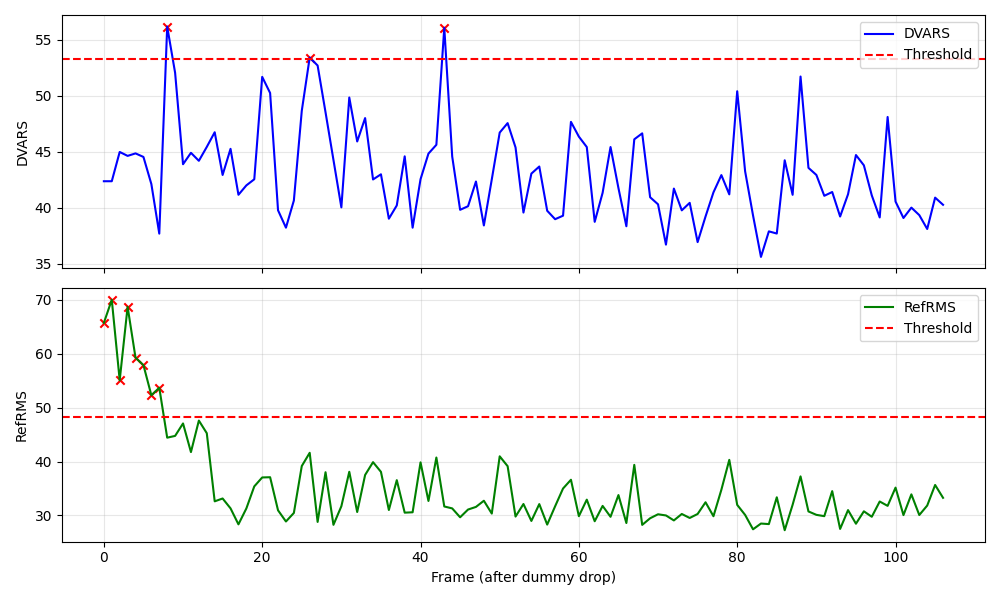
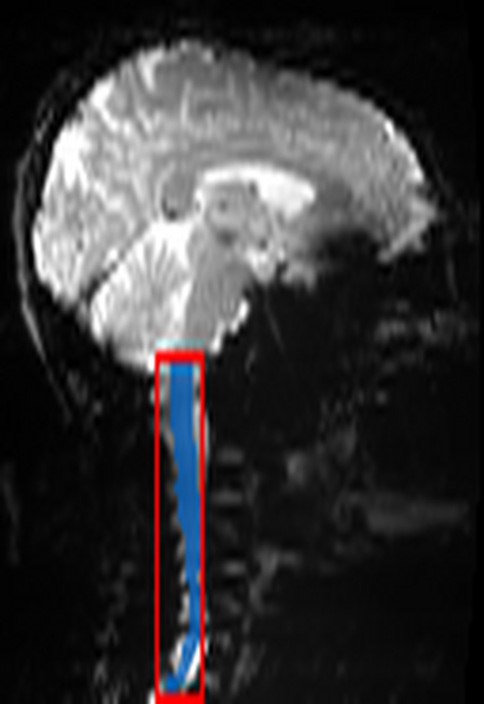
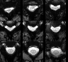

---
search:
  boost: 2
---

# S3: Functional Initialization & Crop

**Step Code:** `S3_func_init_and_crop`  
**Depends on:** S2 (Anatomical Cord Reference), BIDS Functional Data  
**Required by:** S4 (Motion Correction)

---

## Purpose

S3 prepares raw functional data for motion correction and downstream processing. Functional MRI of the spinal cord suffers from physiological noise, variable field of view, and susceptibility artifacts. This step ensures a clean starting point by:

1.  ** stabilizing the time series** (dropping dummy volumes)
2.  **Locating the cord** directly in functional space
3.  **Identifing and gating outlier frames** to create a robust reference
4.  **Cropping the FOV** to the spinal cord to reduce computational load and improve registration

---

## Algorithm Overview

The S3 step consists of three sequential subtasks:

| Subtask | Name | Description |
|---------|------|-------------|
| S3.1 | Dummy Drop & Localization | Remove initial unstable frames, compute fast reference, localize cord |
| S3.2 | Outlier Gating | Compute DVARS/RefRMS metrics, identify bad frames, create robust reference |
| S3.3 | Crop & QC | Apply cord-focused crop, generate quality control reportlets |

---

## S3.1: Dummy Drop & Localization

### Rationale

MRI scanners require a few TRs to reach steady-state magnetization. These initial "dummy" volumes have inconsistent contrast and should be discarded. Subsequent processing requires an approximate location of the spinal cord to focus analysis.

### Algorithm

1.  **Dummy Volume Drop** - Remove first $N$ volumes (default: 4)
    ```python
    bold_data = bold_data[..., dummy_count:]
    ```
2.  **Fast Reference** - Compute median of all remaining frames
3.  **Cord Localization** - Segment cord on fast reference using `sct_deepseg`
    ```bash
    sct_deepseg spinalcord -i func_ref_fast.nii.gz -o func_cord_seg.nii.gz -largest 1
    ```

### QC: Functional Localization



**What to look for:**

-   ✅ Blue contour (cord mask) accurately follows the spinal cord in the functional image.
-   ✅ Red box centers on the cord and includes sufficient margin.
-   ❌ FAIL: Mask is empty or tracks non-cord structure (e.g., ghosting artifacts).

---

## S3.2: Outlier Gating

### Rationale

Subject motion and physiological noise can corrupt specific frames. Using a simple mean/median of all frames as a reference for motion correction can bake in these artifacts. Outlier gating ensures the reference image is constructed only from stable, high-quality frames.

### Algorithm

1.  **Metric Computation** (within cord mask):
    *   **DVARS**: Derivative of variance (frame-to-frame change)
    *   **RefRMS**: Root mean square error vs. fast reference
2.  **Outlier Detection**:
    *   Threshold = $P_{75} + 1.5 \times IQR$
    *   Frame is outlier if DVARS *or* RefRMS exceeds threshold
3.  **Robust Reference**:
    *   Compute median of only **non-outlier** frames

### QC: Frame Metrics



**What to look for:**

-   ✅ Metrics (blue/orange lines) vary but stay mostly below thresholds (dashed lines).
-   ✅ Outliers (if any) correspond to visible spikes in the plot.
-   ❌ FAIL: Majority of frames exceed thresholds (suggests severe artifact or bad mask).
-   ❌ FAIL: Periodic spikes aligned with respiration (if TR is aliased with breathing).

---

## S3.3: Crop & QC

### Rationale

Processing the full field-of-view (FOV) is unnecessary and computationally expensive. A tight crop around the spinal cord improves the robustness of subsequent motion correction (S4) by excluding moving structures like the throat and chest.

### Algorithm

1.  **Cylindrical Crop Mask** - Create dynamic mask around centerline
    ```bash
    sct_create_mask -i func_ref.nii.gz -p centerline,cord_seg.nii.gz -size 40mm
    ```
2.  **Apply Crop** - Cut 4D dataset to crop mask extent
    ```bash
    sct_crop_image -i bold.nii.gz -m crop_mask.nii.gz -o funccrop_bold.nii.gz
    ```

### QC: Crop Box Sagittal



**What to look for:**

-   ✅ Red box captures the entire spinal cord segment of interest.
-   ✅ Box is not excessively large (should be ~40mm wide).
-   ❌ FAIL: Cord leaves the crop box at top or bottom.

### QC: Functional Reference Montage

{ width="500" }

**What to look for:**

-   ✅ Clear definition of spinal cord against CSF (bright CSF, dark cord in T2*-weighted).
-   ✅ No severe blurring (indicates robust reference construction worked).
-   ❌ FAIL: "Ghosting" or double-images of the cord.

---

## Outputs

### Derivatives

```
derivatives/spinalfmriprep/{dataset}/sub-{id}/func/
├── sub-{id}_task-{task}_desc-funcref.nii.gz          # Robust reference
├── sub-{id}_task-{task}_desc-funccrop_bold.nii.gz    # Cropped 4D data
├── sub-{id}_task-{task}_desc-funccrop_mask.nii.gz    # Binary crop mask
├── sub-{id}_task-{task}_desc-confounds_timeseries.tsv # Frame metrics (DVARS, etc.)
└── sub-{id}_task-{task}_desc-outliers.json           # List of outlier indices

derivatives/spinalfmriprep/{dataset}/sub-{id}/figures/
├── sub-{id}_..._desc-S3_func_localization_crop_box_sagittal.png
├── sub-{id}_..._desc-S3_frame_metrics.png
├── sub-{id}_..._desc-S3_crop_box_sagittal.png
└── sub-{id}_..._desc-S3_funcref_montage.png
```

---

## CLI Usage

```bash
# Run S3 for a single dataset
poetry run spinalfmriprep run S3_func_init_and_crop \
  --dataset-key <KEY> \
  --datasets-local config/datasets_local.yaml \
  --out work/wf_reg_001

# Run S3 with parallel workers
poetry run spinalfmriprep run S3_func_init_and_crop \
  --scope reg \
  --out work/wf_reg_001 \
  --batch-workers 8
```

---

## QC Status Logic

Automated status determination based on metrics:

```
status = FAIL if:
  - Cord localization fails (no mask generated)
  - Outlier fraction > 50% (data too noisy)
  - Fewer than 10 good frames remain
  - Crop produces < 10 Z slices

status = WARN if:
  - Outlier fraction > 30%

status = PASS otherwise
```

---

## References

1.  **SCT DeepSeg:** Gros et al. *NeuroImage* 184:901-915 (2019). [DOI](https://doi.org/10.1016/j.neuroimage.2018.09.081)
2.  **DVARS:** Power et al. *NeuroImage* 59(3):2142-2154 (2012). [DOI](https://doi.org/10.1016/j.neuroimage.2011.10.018)

---

*Last updated: February 2026*
