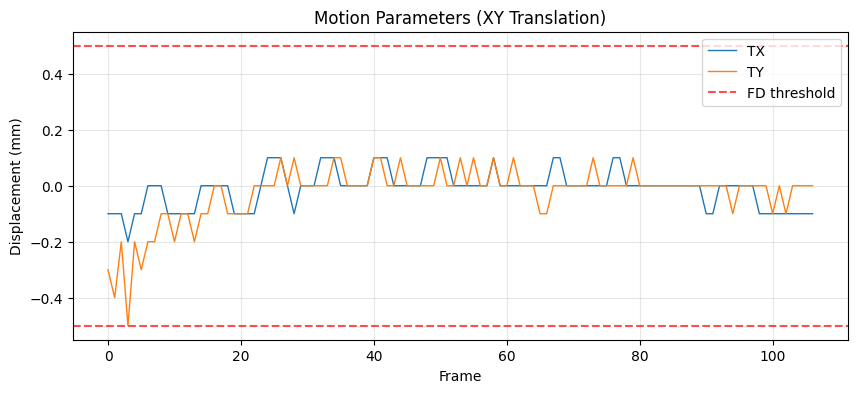
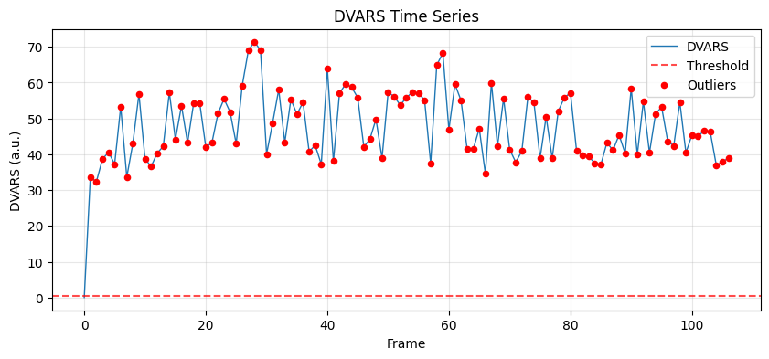

---
search:
  boost: 2
---

# S4: Motion Correction

**Step Code:** `S4_motion_correction`  
**Depends on:** S3 (Functional Initialization & Crop)  
**Required by:** S5 (Distortion Correction), S6 (Registration)

---

## Purpose

S4 minimizes the impact of subject motion on the fMRI time series. Even small movements (< 1mm) can induce significant signal changes in spinal fMRI due to the small cross-sectional area of the cord. This step aligns all functional volumes to the robust reference created in S3.

!!! note "No slice-timing correction"
    The pipeline performs **no slice-timing correction** — it never temporally
    resamples the BOLD series. This is a deliberate choice for cord fMRI,
    following the field standard (Eippert 2017; Kaptan 2023). Slice-timing
    metadata from the BIDS sidecar is used only later, by RETROICOR in S8, to
    phase the cardiac and respiratory regressors.

---

## Algorithm Overview

The S4 step consists of two primary subtasks:

| Subtask | Name | Description |
|---------|------|-------------|
| S4.1 | Motion Correction | Register all volumes to the reference using `sct_fmri_moco` |
| S4.2 | Evaluation & QC | Compute motion metrics (FD, DVARS) and TSNR improvement |

---

## S4.1: Motion Correction

### Rationale

Standard brain motion correction tools (like FSL MCFLIRT) assume a rigid body. The spinal cord, however, is a non-rigid structure that can deform. While fully non-rigid motion correction is complex, a slice-wise or polynomial-regularized approach is more effective for the cord. We use `sct_fmri_moco` with polynomial regularization to account for smooth deformations along the Z-axis.

### Algorithm

1.  **Grouping** - Volumes are grouped (e.g., adjacent 3-5 volumes) to improve SNR for registration if data is noisy (optional).
2.  **Registration** - Each volume (or group) is registered to the S3 Robust Reference using slice-wise translation (Tx, Ty) regularized by a polynomial function along Z.
3.  **Resampling** - The calculated transformations are applied to the original data using spline interpolation.

### Command
```bash
sct_fmri_moco -i funccrop_bold.nii.gz -ref func_ref.nii.gz \
              -g 1 -param params.txt -x spline
```

### QC: Motion Traces



**What to look for:**

-   ✅ Smooth, low-amplitude traces (typically < 1-2 mm).
-   ✅ Periodic motion often corresponds to respiration.
-   ❌ FAIL: Sudden large jumps (> 2-3 mm) or continuous drift indicating scanner instability or severe patient discomfort.

---

## S4.2: Evaluation

### Rationale

We must quantify the success of motion correction. Two key metrics are used:
1.  **DVARS (Derivative of VARiance):** Measures frame-to-frame intensity changes. Spikes in DVARS indicate sudden motion.
2.  **tSNR (temporal Signal-to-Noise Ratio):** The mean signal divided by the standard deviation over time. Effective motion correction should increase tSNR in the cord.

### Algorithm

1.  **Compute DVARS** on the motion-corrected data.
2.  **Compute tSNR** before and after motion correction.
3.  **Generate QC Reportlets**.

### QC: DVARS Plot



**What to look for:**

-   ✅ Few or no spikes crossing the outlier threshold (dashed line).
-   ✅ Lower overall variability compared to raw data (if plotted together).

### QC: tSNR Comparison

{ width="500" }

**What to look for:**

-   ✅ **Right side (After)** should be brighter/redder (higher tSNR) than the **Left side (Before)**, especially inside the cord.
-   ✅ Cord structure should be sharper.
-   ❌ FAIL: tSNR decreases or cord becomes blurry.

---

## Outputs

### Derivatives

```
derivatives/spineprep/{dataset}/sub-{id}/func/
├── sub-{id}_task-{task}_desc-moco_bold.nii.gz        # Motion-corrected 4D data
├── sub-{id}_task-{task}_desc-moco_mean.nii.gz        # Mean of moco_bold
├── sub-{id}_task-{task}_desc-moco_params.tsv         # Motion parameters (Tx, Ty per frame)
└── sub-{id}_task-{task}_desc-confounds_timeseries.tsv # Updated with FD/DVARS

derivatives/spineprep/{dataset}/sub-{id}/figures/
├── sub-{id}_..._desc-S4_motion_traces.png
├── sub-{id}_..._desc-S4_dvars_plot.png
└── sub-{id}_..._desc-S4_tsnr_comparison.png
```

---

## CLI Usage

```bash
# Run S4 for a single dataset
poetry run spineprep run S4_motion_correction \
  --dataset-key <KEY> \
  --datasets-local config/datasets_local.yaml \
  --out work/example
```

---

## QC Status Logic

```
status = FAIL if:
  - Max displacement > 3mm (Tx or Ty)
  - Mean FD > 0.5mm
  - tSNR improvement < 0% (worsened)

status = WARN if:
  - Max displacement > 2mm
  - > 20% frames define as high motion (FD > 0.5mm)
  - tSNR improvement < 5%

status = PASS otherwise
```

---

## References

1.  **SCT Motion Correction:** De Leener et al. *NeuroImage* 145:24-43 (2017). [DOI](https://doi.org/10.1016/j.neuroimage.2016.10.009)
2.  **Framewise Displacement (FD):** Power et al. *NeuroImage* 59(3):2142-2154 (2012).

---

*Last updated: February 2026*
