# Methods Overview

SpinalfMRIprep implements an end-to-end preprocessing pipeline for spinal cord fMRI, designed for robustness against the unique challenges of spinal imaging: physiological noise, small anatomical targets, and susceptibility artifacts.

## Why Spinal Cord fMRI Needs Specialized Preprocessing

Spinal cord fMRI presents fundamentally different challenges compared to brain imaging:

- **Small target anatomy**: The spinal cord cross-section (~50-80 mm²) is roughly 1/1000th the size of a brain slice, requiring sub-millimeter precision in registration and segmentation.
- **Physiological noise**: Cardiac pulsation, respiration, and CSF flow cause signal fluctuations that can exceed the BOLD signal of interest.
- **Susceptibility artifacts**: The cord's proximity to vertebral bodies, lungs, and air-tissue interfaces creates severe B0 inhomogeneities.
- **Motion complexity**: Head, neck, and swallowing motions introduce non-rigid deformations that standard brain motion correction cannot handle.

Traditional brain fMRI pipelines (including fMRIPrep) are not designed for these challenges. SpinalfMRIprep addresses them with spinal-cord-specific algorithms built on the [Spinal Cord Toolbox (SCT)](https://spinalcordtoolbox.com/).

## Comparison with fMRIPrep

| Aspect | fMRIPrep | SpinalfMRIprep |
|--------|----------|----------------|
| **Target anatomy** | Brain | Spinal cord |
| **Registration** | FreeSurfer + ANTs | SCT cord-specific algorithms |
| **Template** | MNI152 | PAM50 spinal cord template |
| **Segmentation** | Brain tissue classes | Cord, canal, vertebrae, rootlets |
| **Motion model** | Rigid-body 6-DOF | Cord-specific with slice-wise options |
| **Distortion correction** | TOPUP/FUGUE | Cord-optimized field mapping |

SpinalfMRIprep follows fMRIPrep's design philosophy—BIDS-native, containerized, QC-first—but implements entirely different algorithms tailored for the spinal cord.

## Pipeline Architecture

```mermaid
flowchart LR
    S0[S0: Setup] --> S1[S1: Input Verify]
    S1 --> S2[S2: Anat Cord Ref]
    S2 --> S2B[S2B: Func Denoise<br/>optional]
    S2B --> S3[S3: Func Init & Crop]
    S3 --> S4[S4: Motion Correction]
    S4 --> S5[S5: Distortion Correction]
    S5 --> S6[S6: Func to Anat Reg]
    S6 --> S7[S7: Template Normalization]
    S7 --> S8[S8: Confounds & Physio]
    S8 --> S9[S9: Functional Derivatives]
    S9 --> S11[S11: QC & Release]
    style S2B stroke-dasharray: 4 4
```

S2B is an optional thermal-noise denoising step that is OFF by default; when
disabled it passes the raw data straight through to S3. There is no S10 in the
active pipeline: the former S10 (analyst-owned region-of-interest timeseries and
connectivity analysis) was removed on 2026-06-11. That analysis belongs to the
analyst downstream, not to the preprocessing release.

The pipeline performs **no slice-timing correction**. This is a deliberate
choice for cord fMRI, following the field standard (Eippert 2017; Kaptan 2023):
slice-timing metadata is used only by RETROICOR in S8 (to phase the cardiac and
respiratory regressors), never to temporally resample the BOLD series.

## Design Principles

| Principle | Implementation |
|-----------|----------------|
| **Validity-first** | Spinal cord measurement validity takes precedence over processing speed |
| **Determinism** | Same inputs + policy → identical outputs, guaranteed |
| **Fail-fast** | No silent downgrades; clear error messages on failure |
| **QC-embedded** | Every step emits machine-readable QC JSON and visual reportlets |

## Step Summaries

| Step | Name | Purpose |
|------|------|---------|
| S0 | Setup | Environment and policy validation |
| S1 | Input Verify | BIDS validation, inventory generation |
| S2 | Anat Cord Ref | Anatomical cord segmentation, PAM50 registration, cord reference |
| S2B | Func Denoise *(optional)* | MP-PCA thermal-noise denoising; OFF by default |
| S3 | Func Init & Crop | Dummy drop, cord localization, FOV cropping, frame QC |
| S4 | Motion Correction | Slice-wise 2D motion correction |
| S5 | Distortion Correction | Susceptibility artifact correction (topup → fugue → SyN) |
| S6 | Func→Anat Registration | Functional-to-anatomical alignment (cord-driven) |
| S7 | Template Normalization | Compose warps to PAM50 template space |
| S8 | Confounds & Physio Regressors | Motion, spike, CSF, RETROICOR, cosine drift, SpinalCompCor regressors |
| S9 | Primary Functional Derivatives | Cord-aware smoothing, PAM50 GLM-ready BOLD, per-level tSNR |
| S11 | QC Aggregation & Release | Cross-dataset QC, reproducibility receipt, methods boilerplate, BIDS-derivatives release |

*S10 (analyst-owned ROI timeseries and connectivity) was removed from the active
pipeline on 2026-06-11 and is no longer part of the preprocessing release.*

---

*For detailed technical descriptions of each step, see the per-step pages in this section.*
