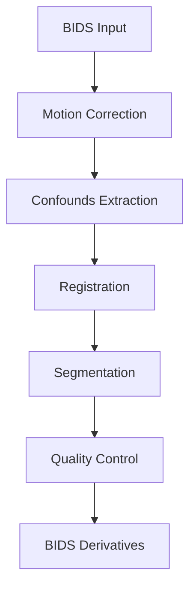

# Usage Guide

This guide covers advanced usage of SpinePrep, including configuration options, command-line interface, and workflow customization.

## Command Line Interface

### Basic Usage

```bash
spineprep [OPTIONS] CONFIG_FILE
```

### Options

- `--version`: Show version information
- `--help`: Show help message
- `--dry-run`: Show what would be executed without running
- `--verbose`: Enable verbose output
- `--debug`: Enable debug mode

### Examples

```bash
# Basic run
spineprep config.yaml

# Dry run to see what would be executed
spineprep --dry-run config.yaml

# Verbose output
spineprep --verbose config.yaml
```

## Configuration

SpinePrep uses YAML configuration files. Here's a complete example:

```yaml
# Basic settings
bids_dir: /data/bids
output_dir: /data/derivatives/spineprep
work_dir: /tmp/spineprep_work

# Processing options
n_procs: 4
memory_gb: 8
omp_nthreads: 2

# Subject selection
participant_label: ["sub-01", "sub-02"]
session_label: ["ses-01"]

# Processing steps
steps:
  motion: true
  confounds: true
  registration: true
  segmentation: true

# Motion correction
motion:
  fd_threshold: 0.5
  dvars_threshold: 75

# Confounds
confounds:
  acompcor: true
  censor: true
  censor_threshold: 0.5

# Registration
registration:
  method: "sct"
  template: "PAM50"
```

## Processing Pipeline

SpinePrep follows a standardized processing pipeline:



### Step Details

1. **Motion Correction**: Realign volumes to reduce motion artifacts
2. **Confounds Extraction**: Extract motion parameters, FD, DVARS, and aCompCor
3. **Registration**: Register to standard space (PAM50)
4. **Segmentation**: Segment spinal cord and vertebral levels
5. **Quality Control**: Generate QC metrics and reports

## Manifests and Samples

SpinePrep uses manifest files to track processing status and samples:

### Samples File

The `samples.tsv` file contains information about each subject/session:

```tsv
participant_id	session_id	task_id	run_id	space	desc	path
sub-01	ses-01	task-rest	run-01	orig	preproc	sub-01/ses-01/func/sub-01_ses-01_task-rest_run-01_bold.nii.gz
```

### Manifest File

The `manifest_deriv.tsv` file tracks derivative files:

```tsv
path	desc	space	res	den	tr	ts	acq	rec	dir	run	modality	chunk	part	ext
sub-01/ses-01/func/sub-01_ses-01_task-rest_run-01_bold.nii.gz	preproc	orig	2.0	0.0	2.0	0.0	0.0	0.0	0.0	1.0	func	0.0	0.0	.nii.gz
```

## Examples

### Basic Preprocessing

```yaml
# config_basic.yaml
bids_dir: /data/bids
output_dir: /data/derivatives/spineprep
n_procs: 4
```

### Advanced Configuration

```yaml
# config_advanced.yaml
bids_dir: /data/bids
output_dir: /data/derivatives/spineprep
work_dir: /tmp/spineprep_work

# Subject selection
participant_label: ["sub-01", "sub-02", "sub-03"]
session_label: ["ses-01"]

# Processing options
n_procs: 8
memory_gb: 16
omp_nthreads: 4

# Motion correction
motion:
  fd_threshold: 0.5
  dvars_threshold: 75
  scrub: true

# Confounds
confounds:
  acompcor: true
  acompcor_n_components: 6
  censor: true
  censor_threshold: 0.5

# Registration
registration:
  method: "sct"
  template: "PAM50"
  crop: true

# Quality control
qc:
  generate_report: true
  report_format: "html"
```

### HPC Configuration

```yaml
# config_hpc.yaml
bids_dir: /data/bids
output_dir: /data/derivatives/spineprep

# Execution backend
execution:
  backend: slurm
  slurm:
    account: your_account
    partition: compute
    time: "4:00:00"
    mem: "16G"
    cpus: 8
    nodes: 1
```

## Troubleshooting

### Common Issues

**Issue**: Out of memory errors
**Solution**: Reduce `memory_gb` or `n_procs` in your configuration.

**Issue**: FSL commands not found
**Solution**: Ensure FSL is properly installed and sourced: `source /usr/local/fsl/etc/fslconf/fsl.sh`.

**Issue**: SCT commands not found
**Solution**: Install Spinal Cord Toolbox and ensure it's in your PATH.

**Issue**: Permission denied errors
**Solution**: Check that you have write permissions to the output directory.

### Debug Mode

Enable debug mode for detailed logging:

```bash
spineprep --debug config.yaml
```

This will show:
- Detailed command execution
- Intermediate file paths
- Memory usage
- Processing times

### Dry Run

Use dry run to see what would be executed:

```bash
spineprep --dry-run config.yaml
```

This shows:
- Which subjects will be processed
- What steps will be run
- Estimated processing time
- Resource requirements
