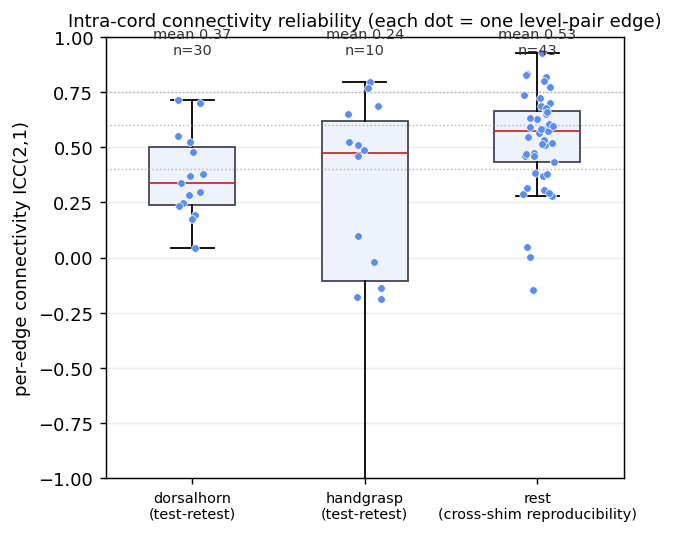
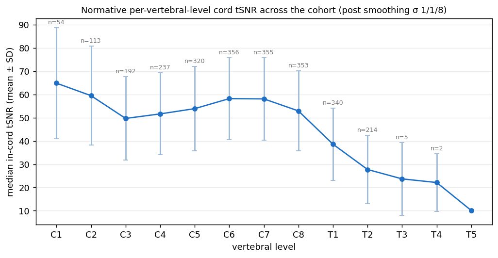
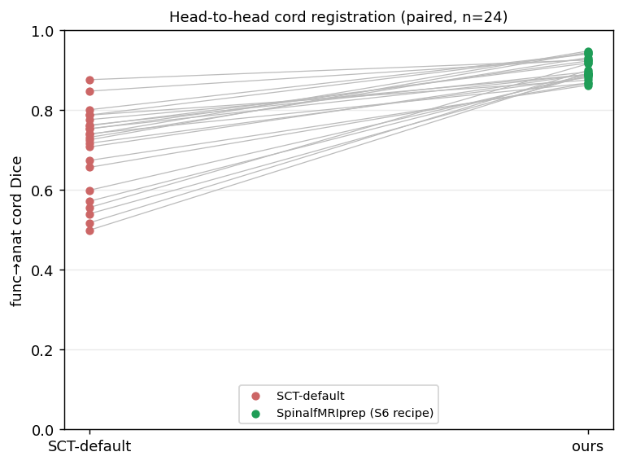

# Validation

!!! info "Preliminary — validation is ongoing"
    This page reports SpinePrep's **current** validation evidence: end-to-end
    robustness across the test cohort, a per-vertebral-level QC reference, a
    test–retest reliability characterisation, and a head-to-head against SCT's
    out-of-the-box defaults. A systematic **reliability × validity study of
    preprocessing choices** is under way and may refine the recommended defaults,
    so treat the numbers below as preliminary. All values are reproducible via the
    scripts in `validation/`.

So far, SpinePrep has been run end to end across **nine datasets (469 functional runs, of which 450 complete the full chain)** spanning rest and four task types (motor, pain/heat, hand-grasp,
dorsal-horn), drawn from public (OpenNeuro) and internal cohorts, across multiple
vendors and acquisition protocols (with and without fieldmaps; cervical-only and
whole-CNS field of view).

> **Note.** Numbers below reflect the locked smoothing kernel (σ = 1/1/8 mm), at
> which all scopes were reprocessed. The reliability values appeared **robust to
> the kernel change** (essentially unchanged on refresh) and the normative tSNR
> shifted by ~1%. All values are reproducible via the scripts in `validation/`.

## 1. Coverage & robustness

All nine datasets run S1→S10 to completion. Attrition is fully reconciled — the
number of runs dropped between any two steps equals the number that FAILed the
earlier step's QC (no silent losses); every surviving derivative is PASS or WARN.

| Scope | Dataset | Paradigm | Runs (S9) | Distortion mode |
|---|---|---|---|---|
| cospain | ds005883 | pain | 33 | TopUp (reverse-PE) |
| cosmotor | ds005884 | motor | 30 | TopUp |
| rest | ds004386 | rest | 90 | SyN (no fieldmap) |
| handgrasp | ds004616 | hand-grasp | 35 | SyN |
| dorsalhorn | ds004926 | heat/pain | 66 | SyN |
| brainspine | ds005075 | rest (whole-CNS) | 27 | SyN |
| exp | balgrist motor + painmotor | motor | 75 | SyN |

**Most runs (roughly four in five) use the image-based SyN fallback** — the field
reality is that most cord-fMRI data ships no fieldmap. Runs that exceed the
TopUp-calibrated displacement ceiling without a fieldmap are flagged
*distortion-limited*, not failed.

## 2. Test-retest reliability (the rigour)

A preprocessing pipeline must yield reproducible science. We measure the
test-retest reliability of pipeline-derived measures via ICC(2,1) (Shrout &
Fleiss 1979), computed by `validation/reliability_*.py`.

The cohort's repeated measures are not uniform, and we label each honestly:

- **Between-session test-retest** (task data): dorsalhorn.
- **Between-session, across an intervention**: handgrasp ds004616 — *not a
  plain test-retest*. Session 2 was acquired 45–60 min after a 30-minute
  acute intermittent hypoxia (AIH) protocol (Hemmerling et al., 2023), which
  was the broader study's purpose. The source paper's own S2−S1 comparison
  found 4 significant voxels in a single contrast and nothing elsewhere, and
  the authors averaged the two sessions on that basis; but grip strength did
  fall measurably between sessions, so the participant's motor state was not
  identical. We report the ICC with that caveat rather than as reliability.
- **Cross-shim reproducibility** (same session, auto vs manual z-shim): rest
  ds004386 — *not* test-retest.
- **Within-session run reliability**: balgrist motor (run-01..04).

**Per-vertebral-level cord tSNR** (test-retest): dorsalhorn ICC(2,1) 0.45–0.75
(mean 0.56, n = 30) — moderate-to-good.

**Intra-cord functional connectivity** (rostro-caudal level×level edges):

- Test-retest: dorsalhorn mean edge ICC 0.37 (max 0.72); handgrasp 0.24 (max 0.79).
- Cross-shim reproducibility: rest 0.53 (median 0.57, max 0.93).
- **Task activation** (per-level beta, active-vs-rest): poor — mean ICC ~0.06
  (handgrasp, dorsalhorn). Consistent with the known low reliability of cord
  *task* fMRI (Dabbagh 2024); the per-level-mean measure also dilutes focal
  (horn-specific) activation — a limitation of the measure, not the pipeline.

These fair-to-moderate values are **consistent with the known difficulty of
cord-fMRI reliability** — connectivity ICC is predominantly poor in the field
(Kaptan 2023; Kowalczyk 2024) and task-activation reliability is poor (Dabbagh
2024). Note split-half temporal stability (Ricchi 2024) runs higher but is
inflated relative to true test-retest; we report between-session ICC. Cross-shim
reproducibility exceeding between-session test-retest is exactly as expected
(same-session is easier than across-day).

## 3. Normative per-vertebral-level QC reference

A multi-site, multi-paradigm **normative QC reference** for cord fMRI
(`validation/normative_qc_db.py`): the cohort-wide distribution of every QC
metric, resolved per vertebral level where applicable. We are not aware of a
comparable per-level reference for cord fMRI, but the cohort is modest and these
distributions should be read as a starting point, not a definitive norm.

Median in-cord tSNR (post anisotropic smoothing) follows the expected
rostro-caudal decline — highest at C6/C7, dropping into the thoracic cord. Full
tables: `validation/results/normative_qc_metrics.tsv`,
`normative_tsnr_per_level.tsv` (n, mean, SD, median, IQR, p5, p95).

## 4. Head-to-head vs SCT-default

To answer "why not just use SCT's defaults?", we compare functional→anatomical
cord registration quality (cord-Dice) between our S6 cord-driven recipe and
out-of-the-box `sct_register_multimodal` on the same runs
(`validation/headtohead_sct_default.py`). The S6 recipe is SpinePrep's own
three-stage composition, not a published recipe reproduced verbatim.

Two caveats a reader should weigh before reading the gap below. First, the
scoring metric favours our arm by construction: our registration is driven by
the cord segmentation, so it optimises the very overlap that cord-Dice measures,
while the SCT-default arm is intensity-driven and does not. Part of the gap is
therefore attributable to the choice of metric rather than to registration
quality, and cord-Dice is best read here as a convergence check. An independent
validator is a planned addition. Second, the runs are not fully independent: the
24 comparisons include the same subjects at two sessions and both hands of the
same session, so roughly 18 independent subjects contribute. The direction of
the effect is consistent across every run; the significance value should be read
as indicative rather than exact.

Across **24 runs / 4 cervical scopes** (dorsalhorn, handgrasp, cosmotor, cospain),
our recipe gives **cord-Dice 0.904 ± 0.03 vs SCT-default 0.704 ± 0.10 (+0.20;
Wilcoxon p = 1.2×10⁻⁷; ours higher in 24/24 runs)** — a large, consistent, highly
significant improvement. Note the comparator is SCT's *out-of-the-box* defaults,
not SCT at its best: SCT itself recommends cord-segmentation-driven registration
with structural-warp initialization — the very recipe SpinePrep automates.
So this quantifies the cost of naive default usage and the value of baking the
recommended recipe into a turnkey pipeline, not a claim to out-register SCT's
best practice.

## 5. Reproducibility

Every release ships a `reproducibility_receipt.json` (tool versions, per-step
policy SHA-256, pipeline git SHA), BIDS-Derivatives `dataset_description.json`,
auto-generated methods boilerplate, and `CITATION.cff`.

What re-running actually guarantees, stated precisely. The registration steps
call ANTs through the Spinal Cord Toolbox. Its stochastic sampler is seeded, so
the dominant source of run-to-run variation is removed by default, and the
receipt records that this was done. Bit-identical output additionally requires
fixing the order in which parallel threads combine their results, which is what
`reproducibility.strict` does by pinning the toolkit to a single thread; it
costs wall-clock time and is therefore off by default. So the honest claim is:
same chain, same policy, same tool versions and same seed reproduce the same
numbers, and strict mode is required for byte-identical files. An end-to-end
demonstration of that is still outstanding and is tracked as a release claim,
not presented as a completed result.
